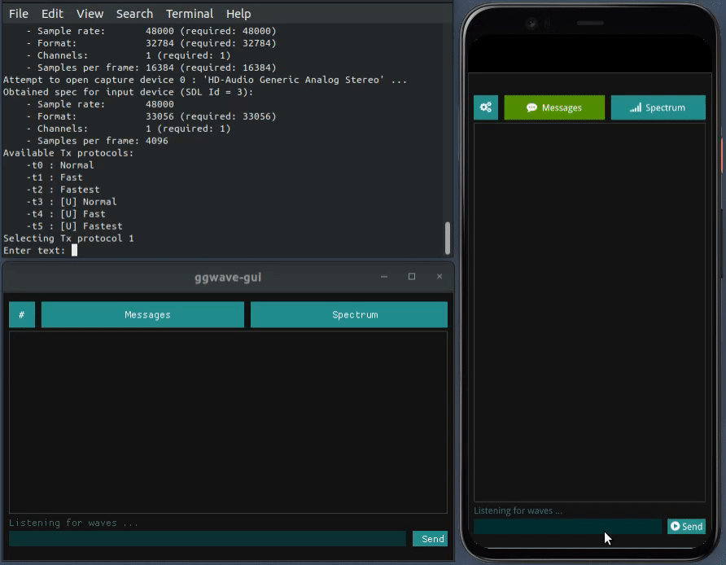

# ggwave

[](https://github.com/ggerganov/ggwave/actions)
[](https://opensource.org/licenses/MIT)
[![ggwave badge][changelog-badge]][changelog]
[](https://pypi.org/project/ggwave/)
[](https://www.npmjs.com/package/ggwave/)

Tiny data-over-sound library.

Click on the images below to hear what it sounds like:

<a href="https://youtu.be/S2YdGefZiy4"></img></a>

<a href="https://user-images.githubusercontent.com/1991296/161401690-013023ba-1d21-4fb7-8d7f-9953f51c1e5b.mp4"></img></a>

<a href="https://youtu.be/Zcgf77T71QM"></img></a>

https://user-images.githubusercontent.com/1991296/166411509-5e1b9bcb-3655-40b1-9dc3-9bec72889dcf.mp4

https://user-images.githubusercontent.com/1991296/168469004-aeb9b9fe-cf81-4db7-b602-62e4ae659341.mp4

<a href="https://youtu.be/aj_GLBtU3Vw"></img></a>

## Details

This library allows you to communicate small amounts of data between air-gapped devices using sound. It implements a simple FSK-based transmission protocol that can be easily integrated in various projects. The bandwidth rate is between 8-16 bytes/sec depending on the protocol parameters. Error correction codes (ECC) are used to improve demodulation robustness.

This library is used only to generate and analyze the RAW waveforms that are played and captured from your audio devices (speakers, microphones, etc.). You are free to use any audio backend (e.g. PulseAudio, ALSA, etc.) as long as you provide callbacks for queuing and dequeuing audio samples.

Here is a list of possible applications of **ggwave** with a few examples:

- **Serverless, one-to-many broadcast**
  - [wave-share](https://github.com/ggerganov/wave-share) - file sharing through sound
- **Internet of Things**
  - [esp32-rx](https://github.com/ggerganov/ggwave/tree/master/examples/esp32-rx), [arduino-rx](https://github.com/ggerganov/ggwave/tree/master/examples/arduino-rx), [rp2040-rx](https://github.com/ggerganov/ggwave/tree/master/examples/rp2040-rx), [arduino-tx](https://github.com/ggerganov/ggwave/tree/master/examples/arduino-tx) - Sand and receive sound data on microcontrollers
  - [r2t2](https://github.com/ggerganov/ggwave/tree/master/examples/r2t2) - Transmit data with the PC speaker
  - [buttons](https://github.com/ggerganov/ggwave/tree/master/examples/buttons) - Record and send commands via [Talking buttons](https://github.com/ggerganov/ggwave/discussions/27)
- **Audio QR codes**
  - [[Twitter]](https://twitter.com/ggerganov/status/1509558482567057417) - Broadcast your clipboard to nearby devices
- **Device pairing**
- **Authorization**

## Try it out

You can easily test the library using the free [waver](https://github.com/ggerganov/ggwave/tree/master/examples/waver) application which is available on the following platforms:

<a href="https://apps.apple.com/us/app/waver-data-over-sound/id1543607865?itsct=apps_box&amp;itscg=30200&ign-itsct=apps_box#?platform=iphone" style="display: inline-block; overflow: hidden; border-radius: 13px; width: 250px; height: 83px;"></a>
<a href='https://play.google.com/store/apps/details?id=com.ggerganov.Waver&pcampaignid=pcampaignidMKT-Other-global-all-co-prtnr-py-PartBadge-Mar2515-1'></a>
<a href="https://snapcraft.io/waver">

</a>

### Browser demos

  - https://waver.ggerganov.com
  - https://ggwave.ggerganov.com
  - https://ggwave-js.ggerganov.com

### [HTTP service](https://github.com/ggerganov/ggwave/blob/master/examples/ggwave-to-file/README.md#http-service)

  ```bash
  # audible example
  curl -sS 'https://ggwave-to-file.ggerganov.com/?m=Hello%20world!' --output hello.wav

  # ultrasound example
  curl -sS 'https://ggwave-to-file.ggerganov.com/?m=Hello%20world!&p=4' --output hello.wav
  ```


## Technical details

Below is a short summary of the modulation and demodulation algorithm used in `ggwave` for encoding and decoding data into sound.

### Modulation (Tx)

The current approach uses a multi-frequency [Frequency-Shift Keying (FSK)](https://en.wikipedia.org/wiki/Frequency-shift_keying) modulation scheme. The data to be transmitted is first split into 4-bit chunks. At each moment of time, 3 bytes are transmitted using 6 tones - one tone for each 4-bit chunk. The 6 tones are emitted in a 4.5kHz range divided in 96 equally-spaced frequencies:

| Freq, [Hz]   | Value, [bits]   | Freq, [Hz]   | Value, [bits]   | ... | Freq, [Hz]   | Value, [bits]   |
| ------------ | --------------- | ------------ | --------------- | --- | ------------ | --------------- |
| `F0 + 00*dF` | Chunk 0: `0000` | `F0 + 16*dF` | Chunk 1: `0000` | ... | `F0 + 80*dF` | Chunk 5: `0000` |
| `F0 + 01*dF` | Chunk 0: `0001` | `F0 + 17*dF` | Chunk 1: `0001` | ... | `F0 + 81*dF` | Chunk 5: `0001` |
| `F0 + 02*dF` | Chunk 0: `0010` | `F0 + 18*dF` | Chunk 1: `0010` | ... | `F0 + 82*dF` | Chunk 5: `0010` |
| ...          | ...             | ...          | ...             | ... | ...          | ...             |
| `F0 + 14*dF` | Chunk 0: `1110` | `F0 + 30*dF` | Chunk 1: `1110` | ... | `F0 + 94*dF` | Chunk 5: `1110` |
| `F0 + 15*dF` | Chunk 0: `1111` | `F0 + 31*dF` | Chunk 1: `1111` | ... | `F0 + 95*dF` | Chunk 5: `1111` |

For all protocols: `dF = 46.875 Hz`. For non-ultrasonic protocols: `F0 = 1875.000 Hz`. For ultrasonic protocols: `F0 = 15000.000 Hz`.

The original data is encoded using [Reed-Solomon error codes](https://github.com/ggerganov/ggwave/blob/master/src/reed-solomon). The number of ECC bytes is determined based on the length of the original data. The encoded data is the one being transmitted.

### Demodulation (Rx)

Beginning and ending of the transmission are marked with special sound markers ([#13](https://github.com/ggerganov/ggwave/discussions/13)). The receiver listens for these markers and records the in-between sound data. The recorded data is then Fourier transformed to obtain a frequency spectrum. The detected frequencies are decoded back to binary data in the same way they were encoded.

Reed-Solomon decoding is finally performed to obtain the original data.


## Examples

The [examples](https://github.com/ggerganov/ggwave/blob/master/examples/) folder contains several sample applications of the library:


| Example | Description | Audio |
| ------- | ----------- | ----- |
| [ggtag](https://github.com/rgerganov/ggtag) | Sound-programmable e-paper badge | PDM mic |
| [ggwave-rx](https://github.com/ggerganov/ggwave/blob/master/examples/ggwave-rx) | Very basic receive-only program | SDL |
| [ggwave-cli](https://github.com/ggerganov/ggwave/blob/master/examples/ggwave-cli) | Command line tool for sending/receiving data through sound | SDL |
| [ggwave-wasm](https://github.com/ggerganov/ggwave/blob/master/examples/ggwave-wasm) | WebAssembly module for web applications | SDL |
| [ggwave-to-file](https://github.com/ggerganov/ggwave/blob/master/examples/ggwave-to-file) | Output a generated waveform to an uncompressed WAV file | - |
| [ggwave-from-file](https://github.com/ggerganov/ggwave/blob/master/examples/ggwave-from-file) | Decode a waveform from an uncompressed WAV file | - |
| [waver](https://github.com/ggerganov/ggwave/blob/master/examples/waver) | GUI application for sending/receiving data through sound | SDL |
| [ggwave-py](https://github.com/ggerganov/ggwave/blob/master/examples/ggwave-py) | Python examples | PortAudio |
| [ggwave-js](https://github.com/ggerganov/ggwave/blob/master/examples/ggwave-js) | Javascript example | Web Audio API |
| [spectrogram](https://github.com/ggerganov/ggwave/blob/master/examples/spectrogram) | Spectrogram tool | SDL |
| [ggweb-spike](https://gitlab.com/commonsguy/ggweb-spike) | Android example using a `WebView` to wrap `ggwave` into a simple app | WebAudio |
| [buttons](https://github.com/ggerganov/ggwave/blob/master/examples/buttons) | Record and send commands via Talking buttons | Web Audio API |
| [r2t2](https://github.com/ggerganov/ggwave/blob/master/examples/r2t2) | Transmit data through the PC speaker | PC speaker |
| [ggwave-objc](https://github.com/ggerganov/ggwave-objc) | Minimal Objective-C iOS app using ggwave | AudioToolbox |
| [ggwave-java](https://github.com/ggerganov/ggwave-java) | Minimal Java Android app using ggwave | android.media |
| [ggwave-fm](https://github.com/rgerganov/ggwave-fm) | Transmit ggwave messages with HackRF | Radio |
| [esp32-rx](https://github.com/ggerganov/ggwave/tree/master/examples/esp32-rx) | Transmit and receive messages using ESP32 | - |
| [rp2040-rx](https://github.com/ggerganov/ggwave/tree/master/examples/rp2040-rx) | Transmit and receive messages using Raspberry Pi Pico (RP2040) | - |
| [arduino-rx](https://github.com/ggerganov/ggwave/tree/master/examples/arduino-rx) | Transmit and receive messages using Arduino RP2040 | - |
| [arduino-tx](https://github.com/ggerganov/ggwave/tree/master/examples/arduino-tx) | Transmit messages using Arduino Uno | - |
| [arduino-rx-web](https://github.com/ggerganov/ggwave/tree/master/examples/arduino-rx-web) | Receive messages from Arduino Uno | Web Audio API |

Other projects using **ggwave** or one of its prototypes:

- [wave-gui](https://github.com/ggerganov/wave-gui) - a GUI for exploring different modulation protocols
- [wave-share](https://github.com/ggerganov/wave-share) - WebRTC file sharing with sound signaling


## Building

### Dependencies for SDL-based examples

    [Ubuntu]
    $ sudo apt install libsdl2-dev

    [Mac OS with brew]
    $ brew install sdl2

    [MSYS2]
    $ pacman -S git cmake make mingw-w64-x86_64-dlfcn mingw-w64-x86_64-gcc mingw-w64-x86_64-SDL2

### Linux, Mac, Windows (MSYS2)

```bash
# build
git clone https://github.com/ggerganov/ggwave --recursive
cd ggwave && mkdir build && cd build
cmake ..
make

# running
./bin/ggwave-cli
```

#### Local Debian packages

Build reproducible `libggwave-dev` and `python3-ggwave` Debian packages:
```bash
# Fetch source
git clone https://github.com/ggerganov/ggwave --recursive
cd ggwave

# Configure
cmake . -DGGWAVE_BUILD_EXAMPLES=OFF -DCMAKE_BUILD_TYPE=Release

# Build
make deb

# Install
sudo dpkg -i dist/*.deb
```

### Emscripten

```bash
git clone https://github.com/ggerganov/ggwave --recursive
cd ggwave
mkdir build && cd build
emcmake cmake ..
make
```

### Python

```bash
pip install ggwave
```

More info: https://pypi.org/project/ggwave/

### Node.js

```bash
npm install ggwave
```

More info: https://www.npmjs.com/package/ggwave

### iOS

Available as a Swift Package: https://github.com/ggerganov/ggwave-spm

## Installing the Waver application

[](https://snapcraft.io/waver)

### Linux

```bash
sudo snap install waver
sudo snap connect waver:audio-record :audio-record
```

### Mac OS

  ```bash
  brew install ggerganov/ggerganov/waver
  ```

[changelog]: ./CHANGELOG.md
[changelog-badge]: https://img.shields.io/badge/changelog-ggwave%20v@PROJECT_VERSION@-dummy
[license]: ./LICENSE
