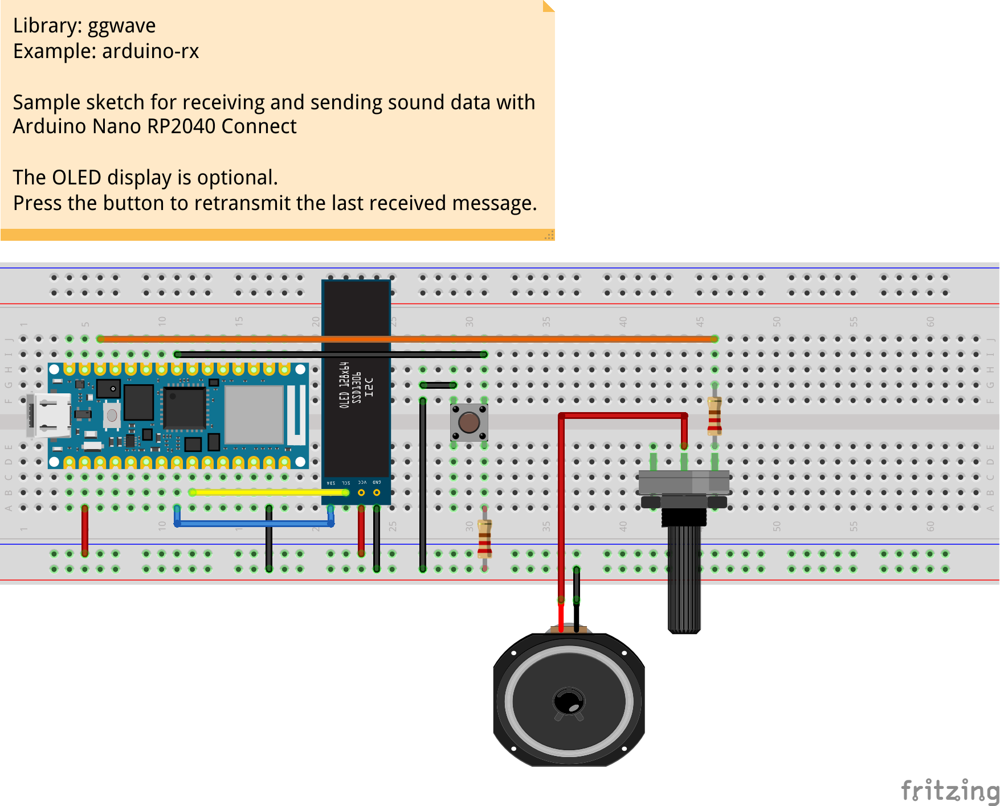

# arduino-rx

This is a sample project for receiving and transmitting audio data using [Arduino RP2040](https://docs.arduino.cc/hardware/nano-rp2040-connect) microcontroller.
The development board has a built-in microphone which makes this device very suitable for data-over-sound projects.

## Setup

- Arduino RP2040 Connect
- OLED SSD1306
- Generic speaker

## Pinout for Arduino Nano RP2040 Connect

### I2C Display (optional)

| MCU           | Display   |
| ------------- | --------- |
| GND           | GND       |
| 3.3V          | VCC / VDD |
| D18 / GPIO 12 | SDA       |
| D19 / GPIO 13 | SCL       |

### Peripherals (optional)

| MCU           | Periph. |
| ------------- | ------- |
|  D5 / GPIO 17 | Button  |
| D10 / GPIO  5 | Speaker |

## Demo

https://user-images.githubusercontent.com/1991296/177210657-3c7421ce-5c12-4caf-a86c-251191eefe50.mp4

[Watch high quality on Youtube](https://youtu.be/HiDpGvnxPLs)
