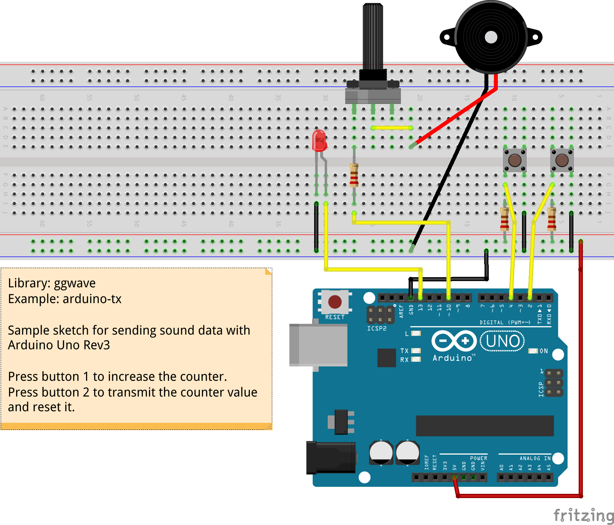

# arduino-tx

This is a sample project for transmitting data via sound using [Arduino Uno](https://store.arduino.cc/products/arduino-uno-rev3) microcontroller.

## Setup

- Arduino Uno R3
- Generic buzzer

## Demo

https://user-images.githubusercontent.com/1991296/168469004-aeb9b9fe-cf81-4db7-b602-62e4ae659341.mp4

[Watch high quality on Youtube](https://youtu.be/qbzKo3zbQcI)
