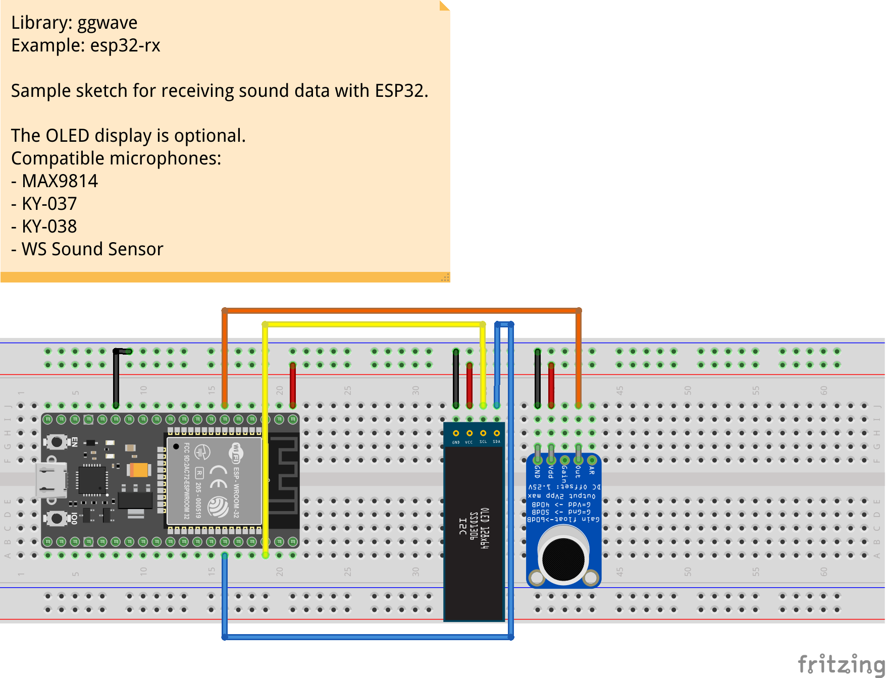

# esp32-rx

This is a sample project for receiving audio data using [ESP32](https://www.espressif.com/en/products/socs/esp32) microcontroller.
The chip has a built-in 12-bit ADC which is used to process the analog audio from the external microphone module in real-time.
The program also support input from I2S MEMS microphones that does not require the usage of the ADC.
The received messages are optionally displayed on the attached OLED display.

## Setup

- NodeMCU-ESP32
- OLED SSD1306
- Microphone, tested with the following, but others could be also supported:
  - Analog:
    - MAX9814
    - KY-037
    - KY-038
    - WS Sound sensor
  - I2S MEMS:
    - SPH0645

## Pinout

### Analog Microphone

| MCU     | Mic       |
| ------- | --------- |
| GND     | GND       |
| 3.3V    | VCC / VDD |
| GPIO 35 | Out       |

### Digital (I2S) Microphone

| MCU     | Mic         |
| ------- | ----------- |
| GND     | GND         |
| 3.3V    | VCC / VDD   |
| GPIO 26 | BCLK        |
| GPIO 33 | Data / DOUT |
| GPIO 25 | LRCL        |

### I2C Display (optional)

| MCU     | Display     |
| ------- | ----------- |
| GND     | GND         |
| 3.3V    | VCC / VDD   |
| GPIO 21 | SDA         |
| GPIO 22 | SCL         |

## Demo

https://user-images.githubusercontent.com/1991296/177211906-2102e9fa-8203-4b80-82e6-4839bf66f01f.mp4

[Watch high quality on Youtube](https://youtu.be/38JoMwdpH6I)
