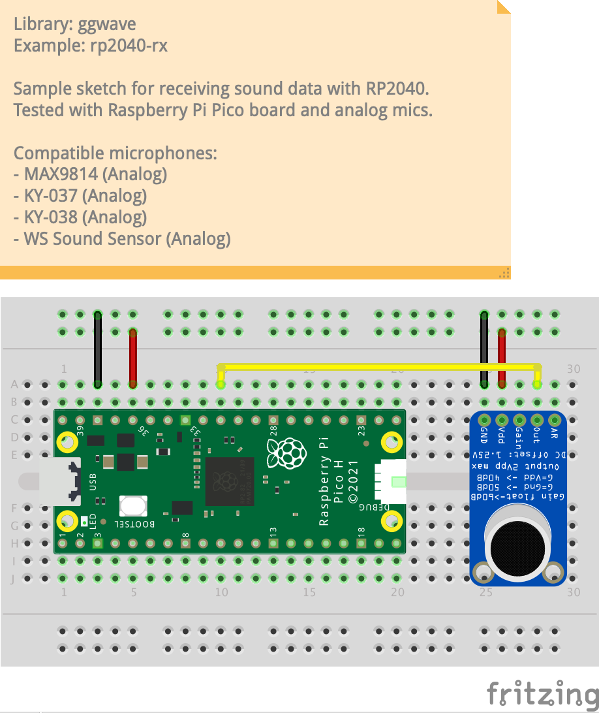

# rp2040-rx

This is a sample project for receiving audio data using [RP2040](https://www.espressif.com/en/products/socs/esp32) microcontroller.
The chip has a built-in 12-bit ADC which is used to process the analog audio from the external microphone module in real-time.

## Setup

- Raspberry Pi Pico (or other RP2040 board)
- Microphone, tested with the following, but others could be also supported:
  - Analog:
    - MAX9814
    - KY-037
    - KY-038
    - WS Sound sensor

## Pinout

### Analog Microphone

| MCU     | Mic       |
| ------- | --------- |
| GND     | GND       |
| 3.3V    | VCC / VDD |
| GPIO 26 | Out       |

